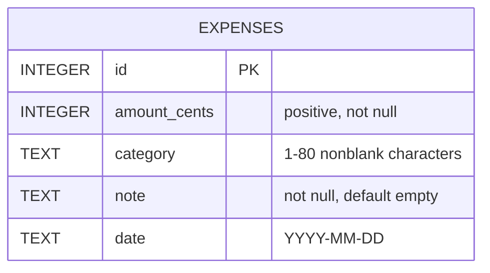

# Mini Spend Tracker

A single-user expense tracker built with Python/FastAPI, SQLite, and plain HTML/JavaScript. Includes a browser UI, category/date filters, monthly summaries, and category spending alerts.

## Run locally

Requires Python 3.10+ (tested with Python 3.12).

```sh
python3 -m venv .venv
source .venv/bin/activate
pip install -r requirements-dev.txt
uvicorn app.main:app --reload
```

Open http://127.0.0.1:8000 for the UI or http://127.0.0.1:8000/docs for interactive API documentation. Run commands from the repository root. SQLite initializes automatically in `data/expenses.db`. Set `DATABASE_PATH` to change the file location. Restarting the server preserves expenses.

```sh
pytest -q
```

`requirements-lock.txt` records the exact tested environment; install it with `pip install -r requirements-lock.txt` for reproducible dependency versions.

## Data model



This single-user version has one table and no relationships. `id` identifies an expense; `amount_cents` stores money as an integer (for example, 1250 means 12.50). The app writes dates in ISO format and normalizes category text. Indexes on `date` and `(category, date)` support listing and summary queries. The date format is validated by the API, not by a database constraint.

## API

### Create an expense

```sh
curl -X POST http://127.0.0.1:8000/expenses \
  -H 'Content-Type: application/json' \
  -d '{"amount":"12.50","category":"Food","note":"Lunch","date":"2026-09-21"}'
```

Returns HTTP 201 with an ID and the stored expense. Amount must be positive, at most 999999999.99, with no more than two decimal places. Category is required (1–80 characters after trimming), normalized to lowercase. Note is optional (maximum 500 characters). Date is a calendar date in `YYYY-MM-DD`; future dates are allowed. Money responses are decimal strings to preserve exact values. Invalid input receives HTTP 422 with a `detail` field; schema errors include field-level messages.

### List expenses

`GET /expenses?category=food&start_date=2026-09-01&end_date=2026-09-30&limit=100&offset=0`

All filters are optional and combine with AND. Date bounds are inclusive. Category matching is exact after trimming/lowercasing. Returns an array ordered by date descending, then ID descending. Limit defaults to 100 (maximum 500); offset defaults to zero. Reversed dates are rejected.

### Summary

`GET /summary?month=2026-09`

The optional month defaults to the server's current calendar month. `total_spend` and `spend_by_category` cover that selected month, not all time. Month-over-month compares complete calendar-month buckets, including a partial current month when selected:

`(selected total - previous total) / previous total * 100`

Percentages are rounded to two decimals. If the previous month has zero spend, change is `null` (undefined), even when both months are empty. Empty months return `"0.00"` and an empty category mapping. Insights identify categories whose spending increased **strictly more than 20%** from a positive previous-month baseline. New categories do not receive a percentage alert. January compares against December of the preceding year.

## Design decisions

- **Integer cents:** decimal validation at the boundary, integer storage and aggregation avoid floating-point errors in monetary totals. This demo assumes a single currency with two decimal places; no currency conversion.
- **SQLite:** a real durable file with constraints and indexes on date and category/date. Parameterized SQL prevents user input from becoming SQL. Each operation opens a short-lived connection, commits writes, and closes it.
- **Small synchronous API:** SQLite calls run in FastAPI's worker thread pool. An app factory and configurable database path isolate tests without mocking the database.
- **Same-origin UI:** served by the API, with no frontend build process or CORS setup. User-provided text is rendered through `textContent`. Save errors are visible; the button is disabled during submission.
- **Scope:** single-user local demonstration, without authentication or public deployment. Do not use it as a shared expense system without adding access control.

## Tests

Tests cover persistence across application restarts, exact monetary totals, invalid and malformed inputs, filtering and pagination, SQL-like category input, inclusive date boundaries, empty summaries, zero baselines, year rollover, declining spend, and the strict insight threshold. UI assets are checked by HTTP.

## With more time

For a larger, multi-user deployment, place an API gateway in front of the service to authenticate requests and apply shared policies such as rate limits. Keep authorization in the backend as well: each expense would have an owner ID, and every query would enforce that ownership. Introduce an ORM such as SQLAlchemy as the data model and relationships grow, with versioned schema migrations; the current parameterized SQL remains appropriate for this one-table demo. I would also add edit/delete operations, automated browser tests, backups, and month-to-date comparisons.
